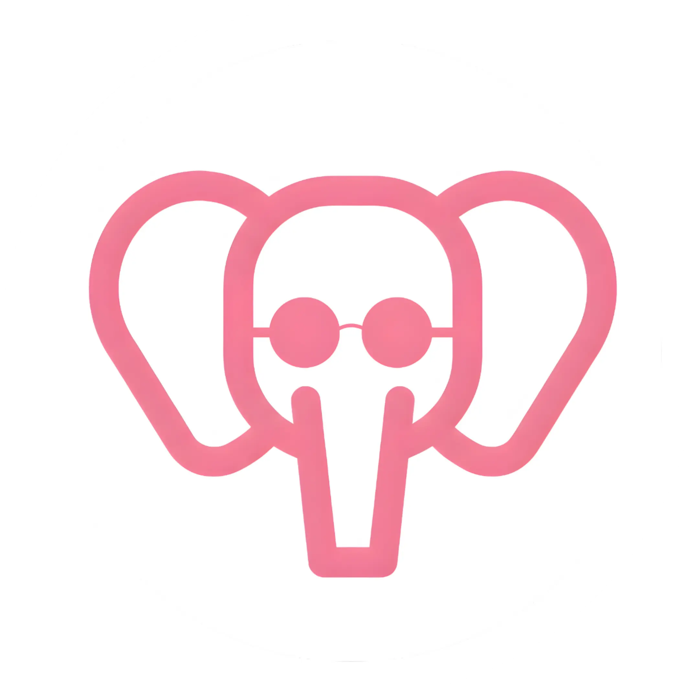

# IQRAIN - Platform Pembelajaran Huruf Hijaiyah Interaktif

<p align="center">
  
</p>

<p align="center">
  
  
  
  
  
  
  
</p>

<p align="center">
  <strong>Platform Pembelajaran Huruf Hijaiyah Khusus untuk Anak Tunarungu</strong>
</p>

<p align="center">
  Platform pembelajaran interaktif berbasis web yang dirancang khusus untuk membantu anak-anak tunarungu belajar huruf hijaiyah melalui game edukatif yang menyenangkan dan visual. Dikembangkan bekerja sama dengan <strong>Yayasan SatiRama</strong> untuk mengakomodasi kebutuhan pembelajaran anak berkebutuhan khusus.
</p>

## 📖 Navigasi Proyek

| Bagian | Deskripsi |
| :--- | :--- |
| <a href="#-dokumentasi-proyek">📄 **Dokumentasi**</a> | Berkas administrasi, Berita Acara, dan Milestone. |
| <a href="#-fitur-utama">✨ **Fitur Utama**</a> | Daftar fungsi dan keunggulan utama sistem. |
| <a href="#-tech-stack">🛠️ **Tech Stack**</a> | Teknologi dan framework yang digunakan. |
| <a href="#-struktur-proyek">📂 **Struktur Proyek**</a> | susunan folder dan arsitektur file. |
| <a href="#-installation">📥 **Instalasi**</a> | Panduan cara menjalankan aplikasi secara lokal. |
| <a href="#-deployment">🚀 **Deployment**</a> | Prosedur rilis produksi dan konfigurasi CI/CD. |
| <a href="#-kolaborasi">👥 **Kolaborasi**</a> | Informasi kemitraan dengan Yayasan SatiRama.. |
| <a href="#-support">💬 **Support**</a> | Kontak Media sosial dan website. |
---

## 📚 Dokumentasi Proyek

### 📄 Administrasi
- [Berita Acara Serah Terima](doc/3SI1_Tim5_Berita_Acara_Serah_Terima.pdf)
- [Surat Perjanjian Alih Hak Sistem](doc/3SI1_Tim5_Surat_Perjanjian_Alih_Hak_Sistem.pdf)

### 🚀 Progres
- [Milestone 4](doc/3SI1_Tim5_Milestone_4.pdf)

### 🛠️ Instalasi
- [Dokumentasi Instalasi](doc/Instalasi_Dokumentasi.pdf)

## 🎯 Fitur Utama

### Game Edukatif Visual
1. **Tracing Game** - Latihan menulis huruf hijaiyah dengan visual tracing
2. **Memory Card** - Mencocokkan kartu huruf hijaiyah dengan gambar
3. **Labirin Game** - Menemukan huruf hijaiyah dalam labirin interaktif
4. **Drag & Drop** - Menyusun huruf hijaiyah dengan feedback visual

### Aksesibilitas untuk Anak Tunarungu
- **Pembelajaran Visual** - Semua materi menggunakan gambar, animasi, dan visual yang jelas
- **Tanpa Audio Dependency** - Tidak bergantung pada instruksi audio
- **Interaksi Intuitif** - Game dirancang dengan kontrol sederhana dan visual feedback yang kuat
- **Kolaborasi dengan Yayasan SatiRama** - Disesuaikan dengan kebutuhan pembelajaran anak tunarungu

### Multi-Role System
- **Admin**: Mengelola mentor, murid, dan konten pembelajaran
- **Mentor**: Membimbing murid, memantau progress, dan memberikan feedback
- **Murid**: Belajar huruf hijaiyah melalui game interaktif visual

### Sistem Monitoring
- Dashboard interaktif untuk setiap role
- Leaderboard global dan per mentor
- Laporan progress pembelajaran detail
- Tracking aktivitas harian

### Materi Pembelajaran
- 30 Huruf Hijaiyah lengkap
- Video pembelajaran untuk setiap huruf
- Modul pembelajaran terstruktur berdasarkan tingkatan Iqra
- Progress tracking per modul

## 🛠️ Tech Stack

### Backend
- **Framework**: Laravel 11.x
- **Database**: MySQL 8.0
- **Authentication**: Laravel Jetstream (Livewire)
- **Real-time**: Livewire 3.x

### Frontend
- **CSS Framework**: Tailwind CSS 3.x
- **JavaScript**: Alpine.js
- **Build Tool**: Vite
- **Icons**: Font Awesome 6.5
- **Fonts**: Google Fonts (Titan One, Mooli, Fredoka, Tegak Bersambung IWK)

### Additional Libraries
- **Tables**: Rappasoft Laravel Livewire Tables
- **Permissions**: Spatie Laravel Permission
- **Notifications**: SweetAlert2

## 📁 Struktur Proyek

```
iqrain/
├── app/
│   ├── Http/
│   │   ├── Controllers/
│   │   │   ├── Admin/           # Controller untuk Admin
│   │   │   ├── Mentor/          # Controller untuk Mentor
│   │   │   └── Murid/           # Controller untuk Murid
│   │   └── Middleware/
│   ├── Livewire/
│   │   ├── Admin/               # Livewire components Admin
│   │   ├── Mentor/              # Livewire components Mentor
│   │   └── Murid/               # Livewire components Murid
│   └── Models/                  # Eloquent Models
│       ├── User.php
│       ├── Admin.php
│       ├── Mentor.php
│       ├── Murid.php
│       ├── HasilGame.php
│       ├── Leaderboard.php
│       └── ...
│
├── database/
│   ├── migrations/              # Database migrations
│   ├── seeders/                 # Database seeders
│   │   ├── DatabaseSeeder.php
│   │   ├── UserSeeder.php
│   │   ├── MateriSeeder.php
│   │   └── LeaderboardSeeder.php
│   └── factories/               # Model factories
│
├── public/
│   ├── images/
│   │   ├── asset/               # Logo dan asset umum
│   │   ├── hijaiyah/            # Gambar huruf hijaiyah
│   │   └── game/                # Asset game
│   └── template/                # Template CSV untuk import
│
├── resources/
│   ├── css/
│   │   └── app.css              # Tailwind CSS
│   ├── js/
│   │   ├── app.js               # Main JavaScript
│   │   ├── memory-card.js       # Memory Card game
│   │   └── bootstrap.js
│   └── views/
│       ├── landing/             # Landing page
│       ├── auth/                # Login & Register
│       ├── pages/
│       │   ├── admin/           # Admin pages
│       │   ├── mentor/          # Mentor pages
│       │   └── murid/           # Murid pages
│       ├── livewire/            # Livewire components views
│       ├── components/          # Blade components
│       └── layouts/             # Layout templates
│
├── routes/
│   ├── web.php                  # Web routes
│   └── api.php                  # API routes
│
└── config/                      # Configuration files
```


### 📁 Core Application (`app/`)
Direktori utama yang berisi logika bisnis aplikasi.

#### **Controllers** (`app/Http/Controllers/`)
Menangani HTTP request dan mengatur alur logika aplikasi. Diorganisir berdasarkan role:
- **Admin/** - Mengelola mentor, murid, materi pembelajaran, dan monitoring sistem
- **Mentor/** - Membimbing murid, melihat progress, approve/reject permintaan bimbingan
- **Murid/** - Akses game, video pembelajaran, modul, dan tracking progress belajar

#### **Livewire Components** (`app/Livewire/`)
Komponen interaktif real-time tanpa page refresh. Terpisah per role untuk organisasi yang jelas:
- **Admin/** - CRUD mentor/murid, import CSV, delete accounts
- **Mentor/** - Approve/reject/cancel permintaan, CRUD murid binaan
- **Murid/** - Form request bimbingan, update profile

#### **Models** (`app/Models/`)
Eloquent ORM models untuk interaksi dengan database:
- `User.php` - Base user dengan polymorphic relationship ke Admin/Mentor/Murid
- `HasilGame.php` - Menyimpan riwayat game dan total poin per sesi
- `Leaderboard.php` - Ranking global dan per mentor
- `ProgressModul.php` - Tracking progress belajar per modul
- `MateriPembelajaran.php`, `Modul.php` - Konten pembelajaran hijaiyah

### 📁 Database Layer (`database/`)

#### **Migrations** (`database/migrations/`)
Schema database yang terstruktur dengan foreign key relationships antar tabel.

#### **Seeders** (`database/seeders/`)
Data awal untuk development dan testing:
- `DatabaseSeeder.php` - Orchestrator utama semua seeder + leaderboard calculation
- `UserSeeder.php` - Akun default admin, mentor, murid
- `MateriSeeder.php` - 30 huruf hijaiyah dengan gambar dan modul pembelajaran
- `LeaderboardSeeder.php` - Kalkulasi ranking dari SUM(HasilGame.total_poin)

### 📁 Frontend Assets (`resources/`)

#### **Views** (`resources/views/`)
Blade templates dengan komponen reusable:
- **landing/** - Landing page dengan SEO optimization
- **auth/** - Login & Register pages
- **pages/** - Halaman per role (admin/mentor/murid) dengan dashboard, CRUD, laporan
- **livewire/** - View untuk Livewire components (modal, form, table)
- **components/** - Reusable components: `seo-meta.blade.php`, navigation, cards
- **layouts/** - Base layouts: `app.blade.php`, `dashboard.blade.php`, `authentication.blade.php`

#### **JavaScript** (`resources/js/`)
- `app.js` - Inisialisasi Livewire, Alpine.js (via CDN), SweetAlert2
- `memory-card.js` - Logic game Memory Card (flip cards, matching)
- `bootstrap.js` - Axios setup untuk HTTP requests

#### **CSS** (`resources/css/`)
- `app.css` - Tailwind CSS dengan custom fonts (Titan One, Mooli, Fredoka, Tegak Bersambung IWK)

### 📁 Public Assets (`public/`)

#### **Images** (`public/images/`)
- **asset/** - Logo IQRAIN (`logo.webp`)
- **hijaiyah/** - 30 gambar huruf hijaiyah untuk game dan pembelajaran (contoh: `Alif.webp`, `Ba.webp`)
- **game/** - Asset visual untuk game (background, icons, avatars)

#### **Template** (`public/template/`)
- `template_import_murid.csv` - Template untuk import murid massal via CSV

### 📁 Routing (`routes/`)
- **web.php** - Semua web routes dengan middleware role-based (admin/mentor/murid)

### 📊 Alur Data Aplikasi

```
User Login → Middleware (Role Check) → Controller/Livewire → Model (Database) → View (Blade)
   ↓
Murid Main Game → HasilGame (store poin) → Leaderboard (update ranking) → Dashboard Mentor
```

**Contoh Flow**: Murid main Tracing Game
1. **Route**: `web.php` → `MuridGameController@tracing`
2. **Controller**: Load modul hijaiyah dari database
3. **View**: `pages/murid/game/tracing.blade.php` render game canvas
4. **JavaScript**: User trace huruf, hitung poin
5. **Store**: POST ke controller → simpan ke `hasil_games` table
6. **Update**: Leaderboard otomatis recalculate ranking
7. **Display**: Dashboard mentor menampilkan progress terbaru


## 🚀 Installation

### Prerequisites
- PHP >= 8.2
- Composer
- Node.js & NPM
- MySQL >= 8.0
- Git

### Step 1: Clone Repository
```bash
git clone <repository-url>
cd iqrain
```

### Step 2: Install Dependencies
```bash
# Install PHP dependencies
composer install

# Install Node dependencies
npm install
```

### Step 3: Environment Configuration
```bash
# Copy environment file
cp .env.example .env

# Generate application key
php artisan key:generate
```

### Step 4: Database Setup
Edit `.env` file dengan database credentials:
```env
DB_CONNECTION=mysql
DB_HOST=127.0.0.1
DB_PORT=3306
DB_DATABASE=iqrain
DB_USERNAME=root
DB_PASSWORD=
```

Create database dan run migrations:
```bash
# Create database
mysql -u root -e "CREATE DATABASE iqrain"

# Run migrations
php artisan migrate

# Seed database dengan data awal
php artisan db:seed
```

### Step 5: Build Assets
```bash
# Development
npm run dev

# Production
npm run build
```

### Step 6: Run Application
```bash
php artisan serve
```

Aplikasi akan berjalan di `http://localhost:8000`

## 👤 Default Accounts

Setelah running seeder, gunakan akun berikut untuk login:

### Admin
- Username: `admin`
- Password: `@qira123`

### Mentor
- Username: `mentor`
- Password: `password`

### Murid
- Username: `murid`
- Password: `password`

## 📝 Database Schema

### Core Tables

#### users
- `user_id` (PK)
- `username`
- `password`
- `avatar_path`

#### admins, mentors, murids
- Relasi one-to-one dengan users
- Menyimpan data spesifik untuk setiap role

### Learning Tables
- `tingkatan_iqras` - Tingkatan Iqra (1-6)
- `materi_pembelajarans` - Materi per tingkatan
- `moduls` - Modul detail dengan konten
- `video_pembelajarans` - Video tutorial

### Game Tables
- `jenis_games` - Jenis-jenis game
- `hasil_games` - Riwayat game yang dimainkan
- `leaderboards` - Ranking dan total poin

### Relationship Tables
- `permintaan_bimbingans` - Request mentor-murid
- `progress_moduls` - Progress belajar per modul

## 🚀 Deployment

### Requirements
- PHP 8.2+ | MySQL 8.0+ | Node.js 18+

### Production Checklist
```bash
# Set environment
APP_ENV=production
APP_DEBUG=false

# Optimize Laravel
php artisan config:cache
php artisan route:cache
php artisan view:cache
npm run build
```

### GitLab CI/CD
File `.gitlab-ci.yml` tersedia untuk auto-deployment. Setup GitLab CI/CD variables:
- `SSH_PRIVATE_KEY`, `SSH_HOST`, `SSH_USER`, `DEPLOY_PATH`

## 🤝 Kolaborasi

Proyek ini dikembangkan bekerja sama dengan:
- **Yayasan SatiRama** - Partner dalam penyesuaian konten dan metode pembelajaran untuk anak tunarungu
- **Pendidik & Praktisi** - Konsultasi dengan ahli pendidikan anak berkebutuhan khusus

## 📞 Support

- Email: iqrainedu@gmail.com
- Website: https://iqrain.my.id/
- Yt : https://www.youtube.com/@Iqrain-edu

---

**Version**: 1.0.0
**Last Updated**: December 2025

Made with ❤️ for Inclusive Islamic Education
**Terkhusus untuk Anak Tunarungu**