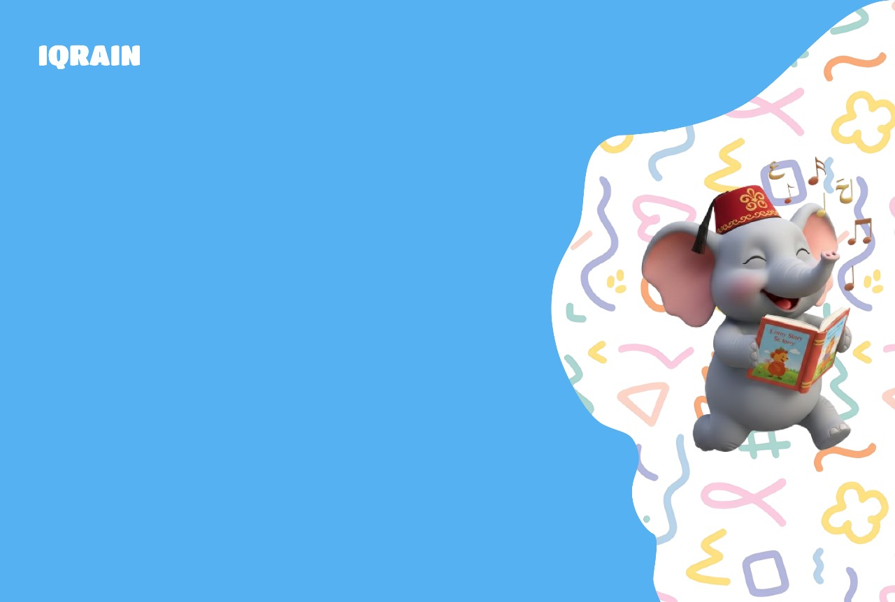
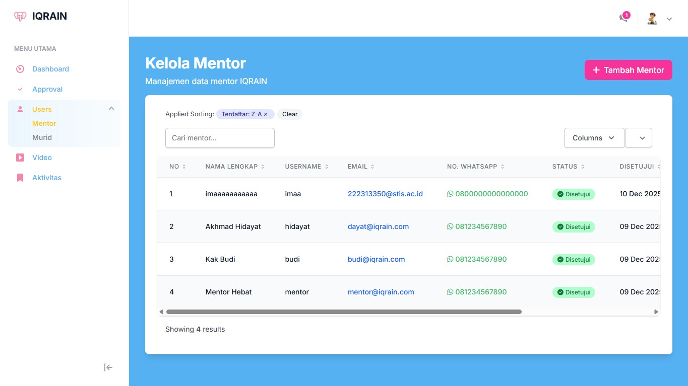
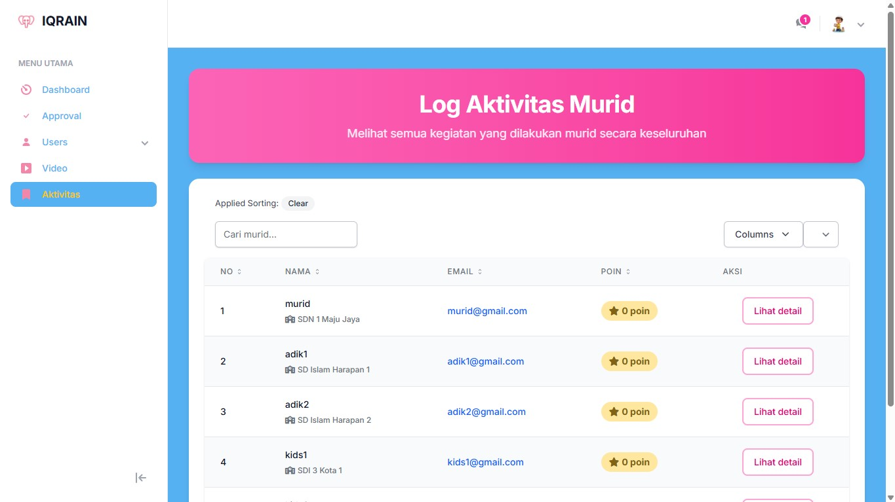

```{r setup, include=FALSE}
knitr::opts_chunk$set(echo = FALSE, warning = FALSE, message = FALSE)
```

\newpage

# Pendahuluan

## Tentang IQRAIN

**IQRAIN** adalah platform pembelajaran interaktif berbasis web yang dirancang khusus untuk membantu anak-anak tunarungu belajar huruf hijaiyah melalui game edukatif yang menyenangkan dan visual. Platform ini dikembangkan bekerja sama dengan **Yayasan SatiRama** untuk mengakomodasi kebutuhan pembelajaran anak berkebutuhan khusus.

IQRAIN menggabungkan pendekatan pembelajaran visual, interaktif, dan gamifikasi untuk membuat proses belajar mengaji menjadi lebih mudah dipahami dan menyenangkan bagi anak-anak tunarungu.

## Tujuan Aplikasi

Tujuan utama dari platform IQRAIN adalah:

1. **Aksesibilitas Pembelajaran**: Menyediakan platform pembelajaran hijaiyah yang dapat diakses oleh anak tunarungu tanpa bergantung pada instruksi audio
2. **Pembelajaran Visual**: Menggunakan gambar, animasi, dan visual yang jelas untuk membantu pemahaman
3. **Gamifikasi**: Membuat pembelajaran menjadi menyenangkan melalui berbagai game interaktif
4. **Monitoring Progress**: Memungkinkan mentor dan admin untuk memantau perkembangan belajar setiap murid
5. **Kolaborasi Mentor-Murid**: Memfasilitasi bimbingan personal dari mentor kepada murid

## Fitur Utama

### Game Edukatif Visual

1. **Tracing Game** - Latihan menulis huruf hijaiyah dengan visual tracing
2. **Memory Card** - Mencocokkan kartu huruf hijaiyah dengan gambar
3. **Labirin Game** - Menemukan huruf hijaiyah dalam labirin interaktif
4. **Drag & Drop** - Menyusun huruf hijaiyah dengan feedback visual

### Multi-Role System

- **Admin**: Mengelola mentor, murid, dan konten pembelajaran
- **Mentor**: Membimbing murid, memantau progress, dan memberikan feedback
- **Murid**: Belajar huruf hijaiyah melalui game interaktif visual

### Sistem Monitoring

- Dashboard interaktif untuk setiap role
- Leaderboard global dan per mentor
- Laporan progress pembelajaran detail
- Tracking aktivitas harian

### Materi Pembelajaran

- 30 Huruf Hijaiyah lengkap
- Video pembelajaran untuk setiap huruf
- Modul pembelajaran terstruktur berdasarkan tingkatan Iqra (1-6)
- Progress tracking per modul

## Target Pengguna

Platform IQRAIN dirancang untuk tiga kategori pengguna:

1. **Murid** - Anak-anak tunarungu yang ingin belajar huruf hijaiyah
2. **Mentor/Guru** - Pendidik yang membimbing murid dalam pembelajaran
3. **Administrator** - Pengelola sistem yang mengatur konten dan user management

\newpage

# System Requirement

## Kebutuhan Hardware

### Minimum Requirements

- **Processor**: Intel Core i3 atau setara
- **RAM**: 4 GB
- **Storage**: 2 GB ruang kosong
- **Network**: Koneksi internet stabil (min. 2 Mbps)

### Recommended Requirements

- **Processor**: Intel Core i5 atau lebih tinggi
- **RAM**: 8 GB atau lebih
- **Storage**: 5 GB ruang kosong
- **Network**: Koneksi internet 5 Mbps atau lebih

## Kebutuhan Software

### Untuk Developer

- **PHP**: >= 8.2
- **Composer**: Latest version
- **Node.js**: >= 18.x
- **NPM**: >= 9.x
- **MySQL**: >= 8.0
- **Git**: Latest version
- **Web Server**: Apache/Nginx (optional untuk development, bisa pakai `php artisan serve`)

### Untuk Production Server

- **PHP**: >= 8.2 dengan extensions:
  - OpenSSL
  - PDO
  - Mbstring
  - Tokenizer
  - XML
  - Ctype
  - JSON
  - BCMath
  - GD
- **MySQL/MariaDB**: >= 8.0 / >= 10.3
- **Web Server**: Nginx atau Apache dengan mod_rewrite
- **SSL Certificate**: Untuk HTTPS (recommended)

## Browser yang Didukung

Platform IQRAIN mendukung browser modern dengan fitur HTML5, CSS3, dan JavaScript ES6:

- **Google Chrome**: >= 90
- **Mozilla Firefox**: >= 88
- **Microsoft Edge**: >= 90
- **Safari**: >= 14
- **Opera**: >= 76

**Catatan**: Untuk pengalaman terbaik, disarankan menggunakan versi terbaru dari browser yang didukung.

## Spesifikasi Server (untuk Deployment)

### Minimum Server Specs

- **CPU**: 2 Cores
- **RAM**: 2 GB
- **Storage**: 20 GB SSD
- **Bandwidth**: 100 GB/month
- **OS**: Ubuntu 20.04 LTS atau CentOS 8

### Recommended Server Specs

- **CPU**: 4 Cores atau lebih
- **RAM**: 4 GB atau lebih
- **Storage**: 50 GB SSD
- **Bandwidth**: Unlimited
- **OS**: Ubuntu 22.04 LTS
- **Backup**: Daily automated backup

\newpage

# Instalasi Web (Developer)

## Persiapan Environment

Sebelum memulai instalasi, pastikan semua software yang dibutuhkan sudah terinstall:

```bash
# Cek versi PHP
php -v

# Cek versi Composer
composer -V

# Cek versi Node.js
node -v

# Cek versi NPM
npm -v

# Cek versi MySQL
mysql --version
```

## Clone Repository

Clone repository IQRAIN dari Git:

```bash
# Clone repository
git clone <repository-url>

# Masuk ke direktori project
cd iqrain
```

## Instalasi Dependencies

### Install PHP Dependencies

```bash
# Install dependencies Laravel via Composer
composer install
```

### Install Node Dependencies

```bash
# Install dependencies frontend via NPM
npm install
```

## Konfigurasi Database

### Buat File Environment

```bash
# Copy file .env.example menjadi .env
cp .env.example .env

# Generate application key
php artisan key:generate
```

### Setup Database Configuration

Edit file `.env` dan sesuaikan konfigurasi database:

```env
DB_CONNECTION=mysql
DB_HOST=127.0.0.1
DB_PORT=3306
DB_DATABASE=iqrain
DB_USERNAME=root
DB_PASSWORD=
```

### Buat Database

```bash
# Buat database via MySQL CLI
mysql -u root -e "CREATE DATABASE iqrain CHARACTER SET utf8mb4 COLLATE utf8mb4_unicode_ci"
```

Atau bisa menggunakan tool GUI seperti phpMyAdmin, MySQL Workbench, atau HeidiSQL.

## Running Migration & Seeder

### Jalankan Migration

```bash
# Jalankan semua migration
php artisan migrate
```

Migration akan membuat tabel-tabel berikut:
- `users`, `admins`, `mentors`, `murids`
- `tingkatan_iqras`, `materi_pembelajarans`, `moduls`
- `video_pembelajarans`, `jenis_games`, `hasil_games`
- `leaderboards`, `progress_moduls`, `permintaan_bimbingans`
- Dan tabel-tabel supporting lainnya

### Jalankan Seeder

```bash
# Jalankan database seeder
php artisan db:seed
```

Seeder akan mengisi data awal:
- Roles & Permissions (admin, mentor, murid)
- User default (admin, mentor, murid)
- Tingkatan Iqra (1-6)
- Jenis Game (4 game)
- Materi Pembelajaran (30 huruf hijaiyah)
- Video Pembelajaran
- 20 murid dummy dengan hasil game
- Leaderboard dengan ranking

### Default Accounts Setelah Seeding

| Role | Username | Password |
|------|----------|----------|
| Admin | admin | @qira123 |
| Mentor | mentor | password |
| Murid | murid | password |

## Build Assets

### Development Mode

```bash
# Build assets untuk development (dengan hot reload)
npm run dev
```

Biarkan terminal ini tetap berjalan untuk auto-reload saat ada perubahan file.

### Production Mode

```bash
# Build assets untuk production (optimized & minified)
npm run build
```

## Menjalankan Aplikasi

### Development Server

```bash
# Jalankan Laravel development server
php artisan serve
```

Aplikasi akan berjalan di `http://localhost:8000`

### Production Server

Untuk production, gunakan web server seperti Nginx atau Apache. Contoh konfigurasi Nginx:

```nginx
server {
    listen 80;
    server_name iqrain.my.id;
    root /var/www/iqrain/public;

    add_header X-Frame-Options "SAMEORIGIN";
    add_header X-Content-Type-Options "nosniff";

    index index.php;

    charset utf-8;

    location / {
        try_files $uri $uri/ /index.php?$query_string;
    }

    location = /favicon.ico { access_log off; log_not_found off; }
    location = /robots.txt  { access_log off; log_not_found off; }

    error_page 404 /index.php;

    location ~ \.php$ {
        fastcgi_pass unix:/var/run/php/php8.2-fpm.sock;
        fastcgi_param SCRIPT_FILENAME $realpath_root$fastcgi_script_name;
        include fastcgi_params;
    }

    location ~ /\.(?!well-known).* {
        deny all;
    }
}
```

### Optimasi untuk Production

```bash
# Cache configuration
php artisan config:cache

# Cache routes
php artisan route:cache

# Cache views
php artisan view:cache

# Optimize autoloader
composer install --optimize-autoloader --no-dev
```

\newpage

# Autentikasi

## Login

### Akses Halaman Login

Kunjungi halaman utama aplikasi atau langsung ke `/login`:

```
https://iqrain.my.id/login
```

### Proses Login

1. Masukkan **Username** (bukan email)
2. Masukkan **Password**
3. Klik tombol **Login**


### Redirect Setelah Login

Setelah login berhasil, user akan diarahkan ke dashboard sesuai role:

- **Admin** → `/admin/dashboard`
- **Mentor** → `/mentor/dashboard`
- **Murid** → `/murid/pilih-iqra`

### Troubleshooting Login

| Error | Penyebab | Solusi |
|-------|----------|--------|
| Invalid credentials | Username/password salah | Periksa kembali username dan password |
| Account not verified | Akun mentor belum di-approve | Tunggu approval dari admin |
| Session expired | Session habis | Login ulang |

## Register Murid

Pendaftaran murid dilakukan dalam **2 tahap**: registrasi akun dan pengisian preferensi.

### Tahap 1: Registrasi Akun

1. Klik **"Daftar sebagai Murid"** di halaman login
2. Isi form registrasi:
   - **Username**: Nama pengguna unik (3-20 karakter)
   - **Password**: Minimal 8 karakter
   - **Konfirmasi Password**: Harus sama dengan password
   - **Nama Sekolah**: Asal sekolah murid

3. Klik **"Daftar"**


### Tahap 2: Pengisian Preferensi

Setelah registrasi, murid akan diminta mengisi **pertanyaan keamanan** untuk keperluan lupa password:

1. Pilih 1 pertanyaan dari dropdown
2. Isi jawaban pertanyaan (untuk recovery password nanti)
3. Klik **"Simpan"**

Contoh pertanyaan keamanan:
- Siapa nama ibu kandung Anda?
- Apa nama hewan peliharaan pertama Anda?
- Di kota mana Anda dilahirkan?


### Halaman Selamat Datang

Setelah registrasi selesai, murid akan melihat halaman selamat datang dan dapat langsung login atau auto-login.

## Register Mentor

Pendaftaran mentor memerlukan **approval dari admin** sebelum dapat mengakses sistem.

### Proses Registrasi Mentor

1. Klik **"Daftar sebagai Mentor"** di halaman login
2. Isi form registrasi:
   - **Nama Lengkap**: Nama lengkap mentor
   - **Username**: Username unik (3-20 karakter)
   - **Email**: Email aktif (untuk notifikasi & recovery password)
   - **No. WhatsApp**: Nomor HP aktif
   - **Password**: Minimal 8 karakter
   - **Konfirmasi Password**: Harus sama dengan password

3. Klik **"Daftar"**


### Status Pending

Setelah mendaftar, mentor akan melihat halaman **"Menunggu Persetujuan"**:

- Status akun: **Pending**
- Tidak bisa login sampai di-approve admin
- Akan mendapat notifikasi email saat di-approve/reject


### Proses Approval (Admin)

Admin akan mereview pendaftaran dan melakukan salah satu:

1. **Approve** → Mentor bisa login
2. **Reject** → Mentor mendapat notifikasi penolakan dengan alasan

## Lupa Password Murid

Murid menggunakan **pertanyaan keamanan** untuk reset password.

### Langkah-langkah Reset Password

1. Klik **"Lupa Password"** di halaman login
2. Masukkan **Username** → Klik **"Lanjut"**


3. Sistem akan menampilkan pertanyaan keamanan yang dipilih saat registrasi
4. Masukkan **jawaban** yang benar → Klik **"Verifikasi"**


5. Jika jawaban benar, masukkan **password baru**:
   - Password Baru
   - Konfirmasi Password Baru
6. Klik **"Reset Password"**


### Tips Keamanan

- Jawaban pertanyaan keamanan **case-sensitive**
- Simpan jawaban di tempat aman
- Gunakan password yang kuat (kombinasi huruf, angka, simbol)

## Lupa Password Mentor

Mentor menggunakan **email verification** untuk reset password.

### Langkah-langkah Reset Password

1. Klik **"Lupa Password"** di halaman login
2. Masukkan **Username** → Klik **"Lanjut"**


3. Sistem akan menampilkan form input email
4. Masukkan **email** yang terdaftar → Klik **"Kirim Link Reset"**


5. Cek email inbox/spam
6. Klik link reset password di email (valid 60 menit)
7. Masukkan password baru di halaman reset


### Troubleshooting

| Masalah | Solusi |
|---------|--------|
| Email tidak masuk | Cek folder spam/junk |
| Link expired | Request link baru |
| Email tidak terdaftar | Hubungi admin untuk verifikasi |

## Logout

Untuk logout dari aplikasi:

1. Klik **nama user** atau **foto profil** di pojok kanan atas
2. Klik **"Logout"**
3. Session akan dihapus dan redirect ke halaman landing

\newpage

# Panduan Murid

## Pilih Tingkatan Iqra

Setelah login, murid akan diarahkan ke halaman **Pilih Tingkatan Iqra**.

### Tingkatan yang Tersedia

Platform IQRAIN menyediakan 6 tingkatan Iqra:

| Tingkatan | Deskripsi | Jumlah Materi |
|-----------|-----------|---------------|
| Iqra 1 | Pengenalan huruf hijaiyah dasar | 5 materi |
| Iqra 2 | Huruf hijaiyah dengan harakat | 5 materi |
| Iqra 3 | Huruf hijaiyah bersambung | 5 materi |
| Iqra 4 | Bacaan panjang (Mad) | 5 materi |
| Iqra 5 | Bacaan bertasydid | 5 materi |
| Iqra 6 | Bacaan tajwid lanjutan | 5 materi |


### Cara Memilih Tingkatan

1. Klik kartu tingkatan yang ingin dipelajari
2. Murid akan diarahkan ke halaman modul pembelajaran tingkatan tersebut

### Rekomendasi Belajar

- Mulai dari **Iqra 1** jika baru pertama kali belajar
- Lanjutkan ke tingkat berikutnya setelah menyelesaikan evaluasi
- Bisa mengulang tingkatan sebelumnya kapan saja

## Modul Pembelajaran

Setiap tingkatan Iqra memiliki beberapa modul pembelajaran yang berisi video dan materi huruf hijaiyah.

### Halaman Modul

Setelah memilih tingkatan, murid akan melihat:

1. **Video Pembelajaran**: Video tutorial dengan isyarat tangan
2. **Daftar Materi**: Materi huruf hijaiyah yang tersedia
3. **Progress Bar**: Progress penyelesaian modul


### Video Pembelajaran

Video pembelajaran berisi:

- Tutorial cara membaca huruf hijaiyah
- **Isyarat tangan** (sign language) untuk setiap huruf
- Cara penulisan huruf
- Contoh penggunaan huruf dalam kata

**Fitur Video**:
- Play/Pause
- Volume control
- Fullscreen mode
- Subtitle (jika tersedia)

### Materi Huruf Hijaiyah

Setiap materi berisi gambar huruf hijaiyah, teks latin (cara baca), penjelasan singkat tentang huruf, dan audio pelafalan (optional).

### Progress Tracking

Sistem akan mencatat:

- Modul yang sudah dipelajari
- Waktu belajar
- Progress penyelesaian per tingkatan

Progress dapat dilihat oleh:
- Murid sendiri
- Mentor pembimbing
- Admin sistem

## Game Pembelajaran

IQRAIN menyediakan **4 jenis game edukatif** untuk melatih hafalan dan pemahaman huruf hijaiyah.

### Halaman Pilih Game

Setelah mempelajari modul, murid dapat bermain game:

1. Klik tombol **"Main Game"** di halaman modul
2. Pilih salah satu dari 4 game yang tersedia


### Memory Card

**Konsep**: Mencocokkan kartu huruf hijaiyah dengan nama latinnya.

**Cara Bermain**:

1. Klik kartu untuk membuka
2. Cari pasangan kartu yang cocok
3. Jika cocok, kartu akan tetap terbuka
4. Jika tidak cocok, kartu akan tertutup kembali
5. Selesaikan semua pasangan untuk menang

**Scoring**:
- Skor dasar: 100 poin
- Bonus waktu: Lebih cepat = lebih banyak poin
- Penalti salah: -5 poin per kesalahan


**Tips**:
- Hafalkan posisi kartu yang sudah dibuka
- Mainkan dengan fokus dan tidak terburu-buru
- Ulang permainan untuk meningkatkan skor

### Tracing Game

**Konsep**: Menulis huruf hijaiyah dengan tracing di canvas.

**Cara Bermain**:

1. Lihat huruf hijaiyah yang ditampilkan
2. **Trace** (ikuti garis) huruf dengan mouse/touch
3. Sistem akan menghitung akurasi tracing
4. Semakin akurat, semakin tinggi poin

**Scoring**:
- Akurasi 90-100%: 10 poin
- Akurasi 75-89%: 7 poin
- Akurasi 60-74%: 5 poin
- Di bawah 60%: 2 poin


**Tips**:
- Ikuti garis dengan hati-hati
- Gunakan perangkat dengan layar sentuh untuk pengalaman terbaik
- Latihan membuat semakin mahir

### Labirin

**Konsep**: Menemukan huruf hijaiyah target dalam labirin.

**Cara Bermain**:

1. Lihat **target huruf** yang harus dicari (4 huruf)
2. Navigasi karakter di labirin dengan tombol panah atau WASD
3. Kumpulkan semua huruf target
4. Hindari jalan buntu
5. Selesaikan dalam waktu sesingkat mungkin

**Scoring**:
- Setiap huruf ditemukan: 25 poin
- Bonus waktu: Sisa waktu × 2 poin
- Total maksimal: 100 poin + bonus


**Kontrol**:
- **Arrow Keys** atau **WASD**: Gerakkan karakter
- **Spacebar**: Ambil huruf

**Tips**:
- Rencanakan rute sebelum bergerak
- Perhatikan peta labirin
- Jangan panik jika terjebak

### Drag & Drop

**Konsep**: Menyeret gambar huruf hijaiyah ke nama latin yang benar.

**Cara Bermain**:

1. Lihat gambar huruf hijaiyah di sebelah kiri
2. **Drag** (seret) gambar ke kotak nama latin yang sesuai di sebelah kanan
3. **Drop** (lepaskan) di tempat yang benar
4. Sistem akan memberikan feedback benar/salah
5. Selesaikan semua huruf

**Scoring**:
- Setiap jawaban benar: 10 poin
- Tidak ada penalti untuk salah (bisa coba lagi)
- Total: 10 huruf × 10 poin = 100 poin maksimal


**Tips**:
- Pelajari huruf dari modul terlebih dahulu
- Perhatikan bentuk huruf dengan teliti
- Jika salah, coba lagi tanpa ragu

### Menyimpan Skor

Setelah menyelesaikan game:

1. Skor akan **otomatis tersimpan** ke database
2. Skor akan ditambahkan ke **total poin murid**
3. **Leaderboard akan diupdate** secara real-time
4. Murid dapat melihat ranking global dan per mentor

## Evaluasi

Setelah menyelesaikan modul dan game, murid dapat melihat **evaluasi** selama bermain game.

### Akses Evaluasi

Klik menu **"Evaluasi"** di halaman tingkatan Iqra


murid akan melihat skor tiap game dan juga komentar dari sistem.

## Leaderboard dan Ranking

Sistem leaderboard menampilkan **ranking murid** berdasarkan total poin dari semua game yang dimainkan.

### Jenis Ranking

IQRAIN memiliki 2 jenis ranking:

1. **Ranking Global**: Ranking di antara semua murid di platform
2. **Ranking Per Mentor**: Ranking di antara murid yang dibimbing oleh mentor yang sama


### Informasi di Leaderboard

| Kolom | Keterangan |
|-------|------------|
| Rank | Posisi ranking (1, 2, 3, ...) |
| Username | Nama pengguna murid |
| Mentor | Nama mentor pembimbing |
| Total Poin | Total poin dari semua game |
| Badge | Badge khusus (juara 1, 2, 3) |

### Cara Meningkatkan Ranking

1. **Mainkan game lebih banyak**: Setiap game memberikan poin
2. **Raih skor tinggi**: Skor tinggi = poin lebih banyak
3. **Konsisten bermain**: Main setiap hari untuk akumulasi poin
4. **Selesaikan evaluasi**: Bonus poin dari evaluasi

### Update Leaderboard

- Leaderboard **otomatis terupdate** setiap kali murid selesai bermain game
- Ranking dihitung ulang secara real-time
- Murid dapat melihat perubahan ranking langsung

## Pilih Mentor

Murid dapat memilih mentor untuk mendapatkan bimbingan personal.

### Akses Halaman Mentor

1. Klik menu **"Mentor"** di dashboard murid
2. Lihat daftar mentor yang tersedia


### Informasi Mentor

Setiap kartu mentor menampilkan:

- **Nama Lengkap**: Nama mentor
- **Email**: Kontak email mentor
- **No. WhatsApp**: Kontak WA mentor
- **Jumlah Murid**: Berapa murid yang dibimbing
- **Status**: Available/Full

### Request Bimbingan

Murid dapat memilih mentor dan klik tombol **"Request Bimbingan"**, kemudian menunggu approval dari mentor yang dipilih.

### Status Permintaan

| Status | Keterangan |
|--------|------------|
| **Pending** | Menunggu approval mentor |
| **Approved** | Request diterima, mentor sudah terhubung |
| **Rejected** | Request ditolak oleh mentor |
| **Cancelled** | Request dibatalkan oleh murid/mentor |

### Setelah Request Disetujui

Setelah mentor approve:

- Murid akan masuk ke **kelas mentor**
- Mentor dapat melihat **progress belajar** murid
- Ranking murid akan masuk **leaderboard mentor**
- Murid dapat berkomunikasi dengan mentor

### Ganti Mentor

Jika ingin ganti mentor:

1. Batalkan request/hubungan dengan mentor saat ini
2. Request ke mentor baru
3. Tunggu approval

## Profil Murid

Murid dapat melihat dan mengedit profil pribadi.

### Akses Profil

1. Klik **nama user** atau **foto profil** di pojok kanan atas
2. Klik **"Profil"**


### Informasi Profil

Profil menampilkan:

- **Username**: Nama pengguna (tidak bisa diubah)
- **Sekolah**: Asal sekolah
- **Mentor**: Nama mentor pembimbing (jika ada)
- **Total Poin**: Total poin dari semua game
- **Ranking Global**: Posisi di leaderboard global
- **Ranking Mentor**: Posisi di leaderboard mentor
- **Avatar**: Foto profil

### Edit Profil

Murid dapat mengubah:

1. **Nama Sekolah**
2. **Avatar/Foto Profil**
3. **Password**

**Cara Edit**:

Klik tombol **"Edit Profil"**, ubah data yang diinginkan (nama sekolah, avatar/foto profil, password), kemudian klik **"Simpan"**.

### Ganti Password

1. Klik **"Ganti Password"**
2. Masukkan:
   - Password Lama
   - Password Baru
   - Konfirmasi Password Baru
3. Klik **"Update Password"**

**Validasi Password**:
- Minimal 8 karakter
- Harus kombinasi huruf dan angka (recommended)

### Upload Avatar

**Format yang diterima**:
- JPG, JPEG, PNG, WEBP
- Maksimal 2 MB
- Resolusi recommended: 500×500 px

**Cara Upload**:
1. Klik area upload atau **"Choose File"**
2. Pilih file gambar
3. Crop jika perlu
4. Klik **"Upload"**

\newpage

# Panduan Mentor

## Dashboard Mentor

Dashboard mentor menampilkan ringkasan aktivitas dan data murid yang dibimbing.

### Akses Dashboard

Setelah login sebagai mentor, akan langsung diarahkan ke:

```
/mentor/dashboard
```


### Informasi di Dashboard

Dashboard menampilkan **statistik penting**:

#### Card Statistik

| Card | Keterangan |
|------|------------|
| **Total Murid** | Jumlah murid yang dibimbing |
| **Murid Aktif** | Murid yang main game 7 hari terakhir |
| **Total Games Dimainkan** | Total semua game oleh semua murid |
| **Avg Completion Rate** | Rata-rata penyelesaian modul |

#### Chart & Grafik

1. **Grafik Aktivitas Harian**: Line chart aktivitas murid 7 hari terakhir
2. **Grafik Game Populer**: Bar chart game yang paling sering dimainkan
3. **Progress Tingkatan**: Pie chart distribusi murid per tingkatan Iqra

#### Tabel Murid Terbaru

Menampilkan **5 murid terakhir** yang melakukan aktivitas:

- Username
- Aktivitas terakhir (game/modul)
- Waktu
- Total poin

### Quick Actions

Tombol akses cepat:

- **Tambah Murid** → Tambah murid baru
- **Lihat Semua Murid** → Halaman kelola murid
- **Permintaan Pending** → Lihat request bimbingan
- **Laporan Kelas** → Export laporan

## Kelola Data Murid

Mentor dapat mengelola (CRUD) data murid yang dibimbing.

### Daftar Murid

Halaman ini menampilkan **tabel interaktif** semua murid binaan.

**Akses**: Menu **Murid** → **Daftar Murid**


#### Fitur Tabel

1. **Search**: Cari murid by username/sekolah
2. **Filter**: Filter by status preferensi, aktivitas
3. **Sort**: Urutkan by total poin, tanggal daftar
4. **Pagination**: Tampilkan 10/25/50 per halaman

#### Kolom Tabel

| Kolom | Keterangan |
|-------|------------|
| ID | ID murid |
| Username | Nama pengguna |
| Sekolah | Asal sekolah |
| Total Poin | Total poin game |
| Games Played | Jumlah game dimainkan |
| Preferensi | Status pengisian preferensi |
| Tanggal Daftar | Waktu registrasi |
| Aksi | Tombol edit/delete/lihat progress |

### Tambah Murid Manual

Mentor dapat mendaftarkan murid secara manual.

**Akses**: Klik tombol **"Tambah Murid"**


#### Form Input

1. **Username**: Username unik (3-20 karakter)
2. **Password**: Password default (bisa diganti murid nanti)
3. **Sekolah**: Asal sekolah
4. **Preferensi Pertanyaan**: (Optional) Isi langsung atau biarkan murid isi sendiri

#### Proses Tambah

1. Isi semua field yang wajib
2. Klik **"Simpan"**
3. Sistem akan membuat:
   - User baru
   - Data murid
   - Relasi mentor-murid otomatis
   - Leaderboard entry

**Notifikasi**:
- Success: "Murid berhasil ditambahkan!"
- Error: "Username sudah digunakan" (jika duplicate)

### Import Murid via CSV

Mentor dapat import banyak murid sekaligus menggunakan file CSV. Download template, isi data (username, password, sekolah), upload file, dan sistem akan validasi data. Username harus unique, password minimal 6 karakter, maksimal 100 murid per import.

### Edit Data Murid

Mentor dapat mengedit data murid yang dibimbing melalui tombol **"Edit"** di tabel murid. Data yang bisa diedit: sekolah, reset password, ubah status preferensi. Username tidak bisa diubah.

### Hapus Murid

Mentor dapat menghapus murid dari bimbingannya.

**Akses**: Klik tombol **"Delete"** di tabel murid

#### Konfirmasi Hapus

Sistem akan menampilkan konfirmasi:

```
Apakah Anda yakin ingin menghapus murid ini?
Data yang akan dihapus:
- User account
- Hasil game
- Progress modul
- Leaderboard entry

Tindakan ini tidak dapat dibatalkan!
```

#### Proses Hapus

Jika confirm **Ya**:

1. Sistem akan cascade delete:
   - `hasil_games` (history game)
   - `progress_moduls` (progress belajar)
   - `leaderboards` (ranking)
   - `preferensi_pertanyaans` (preferensi)
   - `permintaan_bimbingans` (request)
   - `murids` (data murid)
   - `users` (akun user)

2. Leaderboard akan **diperbarui** otomatis
3. Notifikasi: "Murid berhasil dihapus!"

**Warning**: Hapus murid bersifat **permanent** dan tidak bisa di-undo!

## Kelola Permintaan Bimbingan

Halaman untuk mengelola request bimbingan dari murid.

**Akses**: Menu **Permintaan Bimbingan**


### Status Permintaan

| Status | Badge | Keterangan |
|--------|-------|------------|
| **Pending** | 🟡 Kuning | Menunggu keputusan mentor |
| **Approved** | 🟢 Hijau | Diterima, murid jadi binaan |
| **Rejected** | 🔴 Merah | Ditolak oleh mentor |
| **Cancelled** | ⚫ Abu-abu | Dibatalkan |

### Tabel Permintaan

Kolom tabel:

- **Murid**: Username dan sekolah
- **Tanggal Request**: Waktu pengajuan
- **Status**: Status permintaan
- **Aksi**: Tombol approve/reject

### Approve Request

1. Klik tombol **"Approve"** pada request yang diinginkan
2. Konfirmasi approval
3. Sistem akan:
   - Update status → `approved`
   - Set `mentor_id` di tabel `murids`
   - Update leaderboard (masuk ranking mentor)
   - Kirim notifikasi ke murid


**Notifikasi Murid**:
```
Selamat! Permintaan bimbingan Anda kepada [Nama Mentor] telah disetujui.
```

### Reject Request

Mentor dapat menolak permintaan dengan klik tombol **"Reject"**, mengisi alasan penolakan (optional), kemudian klik **"Tolak Permintaan"**. Murid akan mendapat notifikasi penolakan beserta alasannya.

### Cancel Request (dari Mentor)

Mentor dapat membatalkan approval yang sudah diberikan:

1. Klik **"Cancel"** pada request yang statusnya `approved`
2. Konfirmasi pembatalan
3. Murid akan **dilepas** dari bimbingan mentor

**Efek Cancel**:
- `mentor_id` murid jadi `NULL`
- Status request → `cancelled`
- Murid keluar dari leaderboard mentor
- Murid bisa request mentor lain

## Laporan Kelas

Mentor dapat melihat laporan keseluruhan kelas (semua murid binaan).

**Akses**: Menu **Laporan** → **Laporan Kelas**


### Ringkasan Kelas

Card statistik:

| Card | Nilai |
|------|-------|
| Total Murid | 25 murid |
| Rata-rata Poin | 450 poin |
| Total Games Played | 125 games |
| Completion Rate | 65% |

### Grafik Performa Kelas

1. **Grafik Distribusi Poin**: Histogram distribusi poin murid
2. **Grafik Progress Tingkatan**: Berapa murid di tiap tingkatan Iqra
3. **Grafik Game Favorit**: Game yang paling sering dimainkan
4. **Grafik Aktivitas Bulanan**: Aktivitas murid per bulan

### Tabel Top Performers

Menampilkan **10 murid terbaik** (by total poin):

- Ranking
- Username
- Total Poin
- Games Played
- Last Activity

### Filter Laporan

Filter data berdasarkan:

- **Periode**: 7 hari, 30 hari, 90 hari, custom
- **Tingkatan Iqra**: Filter murid di tingkatan tertentu
- **Status**: Aktif/tidak aktif

### Export Laporan

Klik tombol **"Export"** untuk download laporan:

**Format Export**:

Mentor dapat export laporan dalam format PDF (lengkap dengan chart), Excel (data tabel), atau CSV (raw data). Export mencakup statistik kelas, daftar murid dengan detail poin, riwayat aktivitas, dan chart visual.

## Laporan Murid

Mentor dapat melihat laporan detail per murid.

**Akses**: Menu **Laporan** → **Laporan Murid** → Pilih murid



### Informasi Murid

Card profil murid:

- Username
- Sekolah
- Tanggal Bergabung
- Foto Profil

### Statistik Murid

| Metrik | Nilai |
|--------|-------|
| Total Poin | 450 poin |
| Ranking Global | #15 |
| Ranking Mentor | #3 |
| Games Played | 25 games |
| Modul Selesai | 12/30 modul |
| Tingkatan Sekarang | Iqra 3 |

### Grafik Performa

1. **Line Chart Poin**: Perkembangan poin dari waktu ke waktu
2. **Bar Chart Game**: Breakdown poin per jenis game
3. **Progress Modul**: Persentase penyelesaian per tingkatan

### Riwayat Aktivitas

Tabel riwayat aktivitas murid:

| Tanggal | Aktivitas | Detail | Poin |
|---------|-----------|--------|------|
| 2025-12-29 | Game | Memory Card (Iqra 1) | +50 |
| 2025-12-28 | Modul | Modul Alif selesai | - |
| 2025-12-27 | Game | Tracing (Iqra 1) | +45 |
| 2025-12-26 | Evaluasi | Iqra 1 (Skor: 80) | +80 |

### Progress Modul Detail

Tabel progress per modul:

- Tingkatan Iqra
- Nama Modul
- Status (Selesai/Belum)
- Waktu Selesai

### Export Laporan Murid

Export laporan individual:

- **PDF**: Laporan lengkap dengan chart
- **Excel**: Data tabel aktivitas

**Kegunaan Export**:
- Untuk portfolio murid
- Laporan ke orang tua
- Dokumentasi progress

## Edit Profil

Mentor dapat mengedit profil pribadi.

**Akses**: Klik **nama mentor** → **"Edit Profil"**

Mentor dapat mengubah nama lengkap, email, nomor WhatsApp, avatar/foto profil, dan password. Email harus valid & unique, nomor WA harus format Indonesia. Sistem akan logout otomatis setelah ganti password.

\newpage

# Panduan Admin

## Dashboard Admin

Dashboard admin menampilkan overview seluruh sistem IQRAIN.

**Akses**: Setelah login sebagai admin, langsung ke `/admin/dashboard`


### Card Statistik Utama

| Card | Keterangan |
|------|------------|
| **Total Murid** | Jumlah semua murid terdaftar |
| **Total Mentor** | Jumlah mentor approved + pending |
| **Mentor Pending** | Mentor yang menunggu approval |
| **Total Games Played** | Total permainan dari semua murid |
| **Total Video** | Jumlah video pembelajaran |
| **Active Users (30d)** | User yang aktif 30 hari terakhir |

### Grafik Analitik

#### Chart 1: User Growth

Line chart pertumbuhan user (murid + mentor) per bulan:

- X-axis: Bulan
- Y-axis: Jumlah user
- Line: Murid (biru), Mentor (hijau)

#### Chart 2: Game Popularity

Bar chart game yang paling populer:

- X-axis: Jenis game
- Y-axis: Jumlah dimainkan
- Sorted: Tertinggi ke terendah

#### Chart 3: Activity Heatmap

Heatmap aktivitas user per hari dalam seminggu:

- Menampilkan jam & hari paling aktif
- Warna: Hijau terang = aktivitas tinggi

#### Chart 4: Tingkatan Distribution

Pie chart distribusi murid per tingkatan Iqra:

- Iqra 1: 30%
- Iqra 2: 25%
- dst.

### Tabel Aktivitas Terbaru

Menampilkan **20 aktivitas terakhir** dari semua user:

| Waktu | User | Role | Aktivitas |
|-------|------|------|-----------|
| 5 menit lalu | murid001 | Murid | Main Memory Card |
| 10 menit lalu | mentor001 | Mentor | Approve request |
| 15 menit lalu | murid002 | Murid | Selesai Modul Alif |

### Quick Actions

Tombol akses cepat:

- **Approve Mentor** → Halaman approval (jika ada pending)
- **Tambah Video** → Tambah video pembelajaran
- **View All Users** → Kelola semua user
- **Export Data** → Export data sistem

## Approval

Halaman untuk approve/reject pendaftaran mentor baru.

**Akses**: Menu **Approval** atau klik notifikasi badge pending


### Daftar Mentor Pending

Tabel mentor yang menunggu approval:

| Nama | Email | No. WA | Tanggal Daftar | Aksi |
|------|-------|--------|----------------|------|
| Budi Santoso | budi@email.com | 081234567890 | 28 Dec 2025 | Approve / Reject |
| Ani Wijaya | ani@email.com | 081234567891 | 27 Dec 2025 | Approve / Reject |

### Approve Mentor

**Proses Approval**:

1. Review data mentor (nama, email, no. WA)
2. Klik tombol **"Approve"** (icon ✓ hijau)
3. Konfirmasi approval
4. Sistem akan:
   - Update `status_approval` → `approved`
   - Set `tgl_persetujuan` → now()
   - Kirim **email notifikasi** ke mentor
   - Mentor bisa langsung login

**Email Notifikasi ke Mentor**:

```
Subject: Akun Mentor IQRAIN Anda Telah Disetujui

Halo [Nama Mentor],

Selamat! Pendaftaran Anda sebagai Mentor di IQRAIN telah disetujui.

Anda sekarang dapat login menggunakan:
Username: [username]
Link Login: https://iqrain.my.id/login

Terima kasih telah bergabung dengan IQRAIN!

Salam,
Tim IQRAIN
```

### Reject Mentor

**Proses Rejection**:

1. Klik tombol **"Reject"** (icon ✗ merah)
2. **Wajib** isi alasan penolakan
3. Klik **"Tolak Pendaftaran"**
4. Sistem akan:
   - Update `status_approval` → `rejected`
   - Simpan `alasan_tolak`
   - Kirim email notifikasi ke mentor

**Contoh Alasan Penolakan**:

- "Data tidak lengkap atau tidak valid"
- "Email tidak dapat diverifikasi"
- "Tidak memenuhi kriteria sebagai mentor"
- "Duplikasi pendaftaran"

**Email Notifikasi ke Mentor**:

```
Subject: Pendaftaran Mentor IQRAIN Ditolak

Halo [Nama Mentor],

Mohon maaf, pendaftaran Anda sebagai Mentor di IQRAIN tidak dapat kami setujui.

Alasan: [Alasan dari admin]

Jika Anda merasa ini adalah kesalahan, silakan hubungi kami di iqrainedu@gmail.com

Terima kasih atas minat Anda.

Salam,
Tim IQRAIN
```

### Filter & Search

Tabel approval memiliki fitur:

- **Search**: Cari by nama/email
- **Filter by Date**: Filter by tanggal pendaftaran
- **Sort**: Urutkan by tanggal (terbaru/terlama)

## User Management

Admin dapat mengelola semua user (mentor & murid) di sistem.

### Kelola Mentor

**Akses**: Menu **User** → **Mentor**



#### Tabel Mentor

Kolom tabel:

| Kolom | Keterangan |
|-------|------------|
| ID | ID mentor |
| Nama Lengkap | Nama mentor |
| Username | Username login |
| Email | Email kontak |
| No. WA | Nomor WhatsApp |
| Jumlah Murid | Murid yang dibimbing |
| Status | Approved/Pending/Rejected |
| Tanggal Approval | Waktu di-approve |
| Aksi | Edit / Delete |

#### Tambah Mentor Manual

Admin dapat mendaftarkan mentor langsung tanpa approval:

1. Klik **"Tambah Mentor"**
2. Isi form:
   - Nama Lengkap
   - Username
   - Email
   - No. WhatsApp
   - Password
3. Klik **"Simpan"**
4. Mentor langsung `approved` (skip approval)

#### Edit Mentor

Admin dapat edit data mentor:

1. Klik **"Edit"** di tabel
2. Ubah data yang diperlukan:
   - Nama Lengkap
   - Email
   - No. WA
   - Status Approval (approved/rejected)
   - Reset Password
3. Klik **"Update"**

**Catatan**: Username tidak bisa diubah

#### Hapus Mentor

1. Klik **"Delete"**
2. Konfirmasi penghapusan
3. Sistem akan:
   - Set `mentor_id` murid binaan → `NULL`
   - Hapus `permintaan_bimbingans`
   - Hapus akun mentor
   - Update leaderboard

**Warning**: Hapus mentor akan **melepas semua murid binaannya**!

### Kelola Murid

**Akses**: Menu **User** → **Murid**


#### Tabel Murid

Kolom tabel:

| Kolom | Keterangan |
|-------|------------|
| ID | ID murid |
| Username | Username login |
| Sekolah | Asal sekolah |
| Mentor | Nama mentor pembimbing |
| Total Poin | Total poin game |
| Games Played | Jumlah game dimainkan |
| Preferensi | Status pengisian preferensi |
| Tanggal Daftar | Waktu registrasi |
| Aksi | View / Edit / Delete |

#### Filter Murid

Filter tersedia:

- **Status Mentor**: Punya mentor / Belum punya mentor
- **Preferensi**: Sudah terisi / Belum terisi
- **Tingkatan Iqra**: Filter by tingkatan
- **Aktivitas**: Aktif (7 hari) / Tidak aktif

#### Tambah Murid Manual

Admin dapat mendaftarkan murid:

1. Klik **"Tambah Murid"**
2. Isi form:
   - Username
   - Password
   - Sekolah
   - Mentor (optional)
3. Klik **"Simpan"**

#### Edit Murid

Admin dapat edit data murid:

1. Klik **"Edit"**
2. Ubah data:
   - Sekolah
   - Mentor (assign/unassign)
   - Reset Password
3. Klik **"Update"**

#### Hapus Murid

1. Klik **"Delete"**
2. Konfirmasi
3. Cascade delete (hasil game, progress, leaderboard, dll)

#### Import Murid CSV

Admin juga bisa import murid massal via CSV (sama seperti mentor).

## Kelola Video Pembelajaran

Admin dapat menambah, edit, dan hapus video pembelajaran.

**Akses**: Menu **Konten** → **Video Pembelajaran**


### Tabel Video

Kolom tabel:

| Kolom | Keterangan |
|-------|------------|
| ID | ID video |
| Judul | Judul video |
| Tingkatan Iqra | Iqra 1-6 |
| URL/Embed | Link YouTube/Vimeo |
| Durasi | Durasi video (menit) |
| Thumbnail | Preview gambar |
| Tanggal Upload | Waktu ditambahkan |
| Aksi | View / Edit / Delete |

### Tambah Video

**Proses Tambah Video**:

1. Klik **"Tambah Video"**
2. Isi form:
   - **Judul Video**: Judul deskriptif (contoh: "Tutorial Huruf Alif dengan Isyarat")
   - **Tingkatan Iqra**: Pilih tingkatan (1-6)
   - **URL Video**: Link YouTube/Vimeo (akan auto-embed)
   - **Deskripsi**: Penjelasan singkat video
   - **Durasi**: Durasi dalam menit (optional)
   - **Thumbnail**: Upload gambar preview (optional)

3. Klik **"Simpan"**

**Format URL yang Didukung**:

- YouTube: `https://www.youtube.com/watch?v=xxxxx`
- YouTube Embed: `https://www.youtube.com/embed/xxxxx`
- Vimeo: `https://vimeo.com/xxxxx`

**Validasi**:
- URL harus valid
- Tingkatan wajib dipilih
- Thumbnail max 2MB (JPG/PNG)

### Lihat Video

Klik **"View"** untuk preview video:

- Player akan menampilkan video embed
- Informasi detail video
- Statistik views (jika ada)

### Edit Video

1. Klik **"Edit"**
2. Ubah data yang diperlukan:
   - Judul
   - URL
   - Deskripsi
   - Tingkatan
   - Thumbnail
3. Klik **"Update"**

### Hapus Video

1. Klik **"Delete"**
2. Konfirmasi penghapusan
3. Video akan dihapus dari sistem

**Catatan**: Pastikan video tidak sedang digunakan di modul aktif

### Rekomendasi Video

**Konten Video yang Baik**:

- Durasi 3-10 menit (tidak terlalu panjang)
- Menggunakan **isyarat tangan** (sign language)
- Visual jelas dan besar
- Subtitle/teks pendukung
- Tidak bergantung pada audio
- Fokus pada satu huruf hijaiyah
- Contoh aplikasi huruf dalam kata

## Aktivitas Murid

Halaman untuk monitoring aktivitas real-time semua murid.

**Akses**: Menu **Monitoring** → **Aktivitas Murid**



### Tabel Aktivitas Real-time

Kolom tabel:

| Waktu | Murid | Mentor | Aktivitas | Detail | Poin |
|-------|-------|--------|-----------|--------|------|
| 2 menit lalu | murid001 | mentor01 | Game | Memory Card (Iqra 1) | +50 |
| 5 menit lalu | murid002 | mentor01 | Modul | Selesai Modul Ba | - |
| 8 menit lalu | murid003 | - | Game | Tracing (Iqra 2) | +45 |

### Filter Aktivitas

Filter tersedia:

- **Periode**: Hari ini / 7 hari / 30 hari / Custom
- **Jenis Aktivitas**: Game / Modul / Evaluasi
- **Tingkatan Iqra**: Filter by Iqra 1-6
- **Mentor**: Filter by mentor tertentu

### Auto Refresh

Tabel akan **auto-refresh** setiap 30 detik untuk menampilkan aktivitas terbaru.

Toggle auto-refresh: ON / OFF

### Export Aktivitas

Export log aktivitas:

- **Excel**: Data mentah untuk analisis
- **PDF**: Laporan aktivitas dengan chart
- **CSV**: Raw data

**Kegunaan**:
- Monitoring engagement murid
- Identifikasi murid tidak aktif
- Analisis peak hours
- Laporan ke stakeholder

## Tracking Progress

Admin dapat melihat detail progress belajar setiap murid.

**Akses**: Menu **Monitoring** → **Tracking Progress** → Pilih murid


### Daftar Murid

Halaman awal menampilkan semua murid dengan:

- Username
- Total Poin
- Tingkatan Saat Ini
- Progress Completion (%)
- Last Activity
- Tombol **"Lihat Detail"**

### Detail Progress Murid

Setelah klik **"Lihat Detail"**, akan menampilkan:

#### Tab 1: Overview

Card statistik:

| Metrik | Nilai |
|--------|-------|
| Total Poin | 450 |
| Ranking Global | #15 |
| Games Played | 25 |
| Modul Selesai | 12/30 |
| Waktu Belajar | 15 jam |

#### Tab 2: Progress Modul

Tabel progress per tingkatan Iqra:

| Tingkatan | Modul Selesai | Modul Total | Progress | Status |
|-----------|---------------|-------------|----------|--------|
| Iqra 1 | 5/5 | 5 | 100% | ✓ Selesai |
| Iqra 2 | 3/5 | 5 | 60% | 🔄 On Progress |
| Iqra 3 | 0/5 | 5 | 0% | - Belum Mulai |

#### Tab 3: Riwayat Game

Tabel riwayat game:

| Tanggal | Game | Tingkatan | Skor | Poin |
|---------|------|-----------|------|------|
| 29 Dec 2025 | Memory Card | Iqra 1 | 85% | 50 |
| 28 Dec 2025 | Tracing | Iqra 1 | 92% | 45 |
| 27 Dec 2025 | Labirin | Iqra 2 | 78% | 40 |

#### Tab 4: Grafik

Chart visualisasi:

1. **Line Chart**: Perkembangan poin dari waktu ke waktu
2. **Bar Chart**: Poin per jenis game
3. **Pie Chart**: Distribusi aktivitas (modul vs game)

### Export Progress

Export progress individual murid:

- PDF: Laporan lengkap dengan chart
- Excel: Data tabel untuk analisis

## Kelola Soal Evaluasi

Admin dapat menambah, edit, dan hapus soal evaluasi.

**Akses**: Menu **Konten** → **Soal Evaluasi**

### Tabel Soal

Kolom tabel:

| ID | Tingkatan | Pertanyaan | Jenis Soal | Jawaban | Aksi |
|----|-----------|------------|------------|---------|------|
| 1 | Iqra 1 | Huruf ini dibaca? | Pilihan Ganda | Alif | Edit / Delete |
| 2 | Iqra 2 | Cocokkan huruf Ba | Cocokkan | - | Edit / Delete |

### Jenis Soal

IQRAIN mendukung 3 jenis soal evaluasi:

1. **Pilihan Ganda**: Pilih 1 jawaban benar dari 4 opsi
2. **Cocokkan Gambar**: Cocokkan huruf dengan gambar/nama
3. **Isian Singkat**: Tulis jawaban singkat

### Tambah Soal

**Proses Tambah Soal**:

1. Klik **"Tambah Soal"**
2. Pilih **Jenis Soal**:

#### Pilihan Ganda

Form input:

- **Tingkatan Iqra**: Pilih Iqra 1-6
- **Pertanyaan**: Teks pertanyaan atau upload gambar huruf
- **Opsi A**: Pilihan A
- **Opsi B**: Pilihan B
- **Opsi C**: Pilihan C
- **Opsi D**: Pilihan D
- **Jawaban Benar**: Pilih A/B/C/D
- **Poin**: Poin jika benar (default: 10)

#### Cocokkan Gambar

Form input:

- **Tingkatan Iqra**: Pilih Iqra 1-6
- **Jumlah Pasangan**: 5-10 pasangan
- **Upload Gambar**: Upload gambar huruf
- **Pasangan**: Nama latin huruf
- **Poin**: Poin per pasangan benar

#### Isian Singkat

Form input:

- **Tingkatan Iqra**: Pilih Iqra 1-6
- **Pertanyaan**: Teks atau gambar
- **Jawaban Benar**: Jawaban yang diterima (bisa multiple)
- **Case Sensitive**: Ya/Tidak
- **Poin**: Poin jika benar

3. Klik **"Simpan"**

### Edit Soal

1. Klik **"Edit"**
2. Ubah data soal
3. Klik **"Update"**

### Hapus Soal

1. Klik **"Delete"**
2. Konfirmasi penghapusan
3. Soal akan dihapus (tidak memengaruhi hasil evaluasi yang sudah ada)

### Import Soal via Excel

Admin dapat import banyak soal sekaligus:

1. Download template Excel
2. Isi soal sesuai format
3. Upload file
4. Validasi & import

**Format Template**:

| Tingkatan | Jenis | Pertanyaan | Opsi A | Opsi B | Opsi C | Opsi D | Jawaban | Poin |
|-----------|-------|------------|--------|--------|--------|--------|---------|------|
| Iqra 1 | PG | Huruf ini? | Alif | Ba | Ta | Tsa | A | 10 |

\newpage

# Kontak dan Support

## Informasi Kontak

Jika Anda memiliki pertanyaan, masalah, atau butuh bantuan terkait platform IQRAIN, silakan hubungi kami melalui:

### Email

**Email Utama**: iqrainedu@gmail.com

- **Untuk**: Pertanyaan umum, dukungan teknis, feedback
- **Waktu Respons**: 1-2 hari kerja

### Website

**Official Website**: https://iqrain.my.id/

- Landing page dengan informasi lengkap tentang IQRAIN
- Panduan penggunaan
- Link ke platform

## Media Sosial

Ikuti kami di media sosial untuk update terbaru:

### Instagram

**@iqrain.official** (contoh)

- Update fitur baru
- Tips belajar hijaiyah
- Success stories murid

### YouTube

**IQRAIN Edu Channel**: https://www.youtube.com/@Iqrain-edu

- Tutorial penggunaan platform
- Video pembelajaran hijaiyah
- Webinar untuk mentor & guru

### Facebook

**IQRAIN - Belajar Hijaiyah** (contoh)

- Komunitas pengguna
- Diskusi dan tanya jawab
- Event & kompetisi

## Pelaporan Bug/Error

Jika Anda menemukan bug atau error di platform:

### Melalui GitHub Issues

**Repository**: https://github.com/iqrain/iqrain-web (contoh)

**Cara Melaporkan**:

1. Buka tab **Issues**
2. Klik **New Issue**
3. Pilih template **Bug Report**
4. Isi informasi:
   - **Judul**: Deskripsi singkat bug
   - **Deskripsi**: Penjelasan detail
   - **Steps to Reproduce**: Langkah untuk mereproduksi bug
   - **Expected Behavior**: Apa yang seharusnya terjadi
   - **Actual Behavior**: Apa yang terjadi
   - **Screenshots**: Screenshot jika ada
   - **Environment**: Browser, OS, versi

**Contoh Bug Report**:

```markdown
## Bug: Skor tidak tersimpan setelah main Memory Card

**Deskripsi**:
Setelah menyelesaikan game Memory Card, skor tidak tersimpan ke database dan tidak muncul di leaderboard.

**Steps to Reproduce**:
1. Login sebagai murid
2. Pilih Iqra 1
3. Main Memory Card
4. Selesaikan game
5. Cek leaderboard

**Expected**: Skor tersimpan dan ranking terupdate
**Actual**: Skor tidak tersimpan, ranking tetap

**Environment**:
- Browser: Chrome 120
- OS: Windows 11
- Role: Murid
```

### Melalui Email

Kirim laporan bug ke **iqrainedu@gmail.com** dengan subject:

```
[BUG] Deskripsi singkat bug
```

## Request Fitur Baru

Punya ide fitur baru untuk IQRAIN? Kami senang mendengarnya!

### Melalui GitHub Issues

1. Buka tab **Issues**
2. Klik **New Issue**
3. Pilih template **Feature Request**
4. Isi informasi:
   - **Judul**: Nama fitur
   - **Deskripsi**: Penjelasan fitur
   - **Motivation**: Kenapa fitur ini dibutuhkan?
   - **Proposed Solution**: Bagaimana fitur ini bekerja?
   - **Alternatives**: Alternatif solusi lain?

**Contoh Feature Request**:

```markdown
## Feature Request: Dark Mode

**Deskripsi**:
Tambahkan fitur dark mode untuk mengurangi eye strain saat belajar di malam hari.

**Motivation**:
Banyak murid belajar di malam hari. Dark mode akan membuat nyaman dan hemat baterai.

**Proposed Solution**:
- Tambah toggle dark mode di settings
- Simpan preferensi di localStorage
- Apply dark theme ke semua halaman

**Mockup**:
[Attach screenshot/mockup jika ada]
```

### Melalui Email

Kirim request fitur ke **iqrainedu@gmail.com** dengan subject:

```
[FEATURE REQUEST] Nama fitur
```

## FAQ Singkat

| Pertanyaan | Jawaban |
|------------|---------|
| Apakah IQRAIN gratis? | Ya, platform ini gratis untuk digunakan |
| Apakah bisa diakses di HP? | Ya, responsive di semua device |
| Apakah ada aplikasi mobile? | Belum, saat ini masih web-based |
| Bagaimana cara reset password? | Klik "Lupa Password" di halaman login |
| Murid bisa punya lebih dari 1 mentor? | Tidak, murid hanya bisa punya 1 mentor aktif |

**FAQ Lengkap**: Lihat bagian **Lampiran > FAQ**

\newpage

# Lampiran

## Database Schema

### Entity Relationship Diagram (ERD)

Berikut adalah skema database lengkap IQRAIN:

```
users
├── user_id (PK)
├── username (unique)
├── password
├── avatar_path
└── timestamps

admins
├── admin_id (PK)
├── user_id (FK → users)
└── timestamps

mentors
├── mentor_id (PK)
├── user_id (FK → users)
├── nama_lengkap
├── email (unique)
├── no_wa
├── status_approval (pending/approved/rejected)
├── alasan_tolak
├── tgl_persetujuan
└── timestamps

murids
├── murid_id (PK)
├── user_id (FK → users)
├── mentor_id (FK → mentors, nullable)
├── sekolah
├── preferensi_terisi (boolean)
└── timestamps

tingkatan_iqras
├── tingkatan_id (PK)
├── level (1-6)
├── nama_tingkatan
├── deskripsi
└── timestamps

materi_pembelajarans
├── materi_id (PK)
├── tingkatan_id (FK → tingkatan_iqras)
├── judul_materi
├── deskripsi
├── urutan
└── timestamps

moduls
├── modul_id (PK)
├── materi_id (FK → materi_pembelajarans)
├── judul_modul
├── konten_teks
├── gambar_path
├── teks_latin
├── urutan
└── timestamps

video_pembelajarans
├── video_id (PK)
├── tingkatan_id (FK → tingkatan_iqras)
├── judul_video
├── url_video
├── deskripsi
├── durasi
└── timestamps

jenis_games
├── jenis_game_id (PK)
├── nama_game (Memory Card, Tracing, Labirin, Drag & Drop)
├── deskripsi
├── poin_maksimal
└── timestamps

hasil_games
├── hasil_game_id (PK)
├── murid_id (FK → murids)
├── jenis_game_id (FK → jenis_games)
├── skor
├── total_poin
├── dimainkan_at
└── timestamps

progress_moduls
├── progress_id (PK)
├── murid_id (FK → murids)
├── modul_id (FK → moduls)
├── status (selesai/belum)
├── waktu_selesai
└── timestamps

leaderboards
├── leaderboard_id (PK)
├── murid_id (FK → murids)
├── mentor_id (FK → mentors, nullable)
├── total_poin_semua_game (SUM dari hasil_games)
├── ranking_global
├── ranking_mentor
└── timestamps

preferensi_pertanyaans
├── preferensi_id (PK)
├── murid_id (FK → murids)
├── pertanyaan
├── jawaban (hashed)
└── timestamps

permintaan_bimbingans
├── permintaan_id (PK)
├── murid_id (FK → murids)
├── mentor_id (FK → mentors)
├── status (pending/approved/rejected/cancelled)
├── alasan_tolak
├── tanggal_request
├── tanggal_keputusan
└── timestamps
```

### Relasi Utama

**One-to-One**:
- `users` ↔ `admins` / `mentors` / `murids`
- `murids` ↔ `preferensi_pertanyaans`

**One-to-Many**:
- `mentors` → `murids` (1 mentor bisa punya banyak murid)
- `murids` → `hasil_games` (1 murid bisa main banyak game)
- `murids` → `progress_moduls` (1 murid bisa selesaikan banyak modul)
- `tingkatan_iqras` → `materi_pembelajarans`
- `materi_pembelajarans` → `moduls`

**Many-to-Many** (via pivot):
- `murids` ↔ `mentors` via `permintaan_bimbingans`

## API Endpoints (jika ada)

Jika di masa depan IQRAIN mengembangkan REST API, berikut adalah endpoint yang direncanakan:

### Authentication

```
POST /api/auth/login
POST /api/auth/register/murid
POST /api/auth/register/mentor
POST /api/auth/logout
POST /api/auth/refresh
POST /api/auth/forgot-password
POST /api/auth/reset-password
```

### Murid Endpoints

```
GET    /api/murid/profile
PUT    /api/murid/profile
GET    /api/murid/tingkatan
GET    /api/murid/modul/{tingkatan_id}
GET    /api/murid/game/{tingkatan_id}
POST   /api/murid/game/save-score
GET    /api/murid/leaderboard
GET    /api/murid/progress
GET    /api/murid/mentor/list
POST   /api/murid/mentor/request/{mentor_id}
```

### Mentor Endpoints

```
GET    /api/mentor/dashboard
GET    /api/mentor/murid
POST   /api/mentor/murid
PUT    /api/mentor/murid/{id}
DELETE /api/mentor/murid/{id}
GET    /api/mentor/permintaan
POST   /api/mentor/permintaan/{id}/approve
POST   /api/mentor/permintaan/{id}/reject
GET    /api/mentor/laporan/kelas
GET    /api/mentor/laporan/murid/{id}
```

### Admin Endpoints

```
GET    /api/admin/dashboard
GET    /api/admin/approval
POST   /api/admin/approval/{id}/approve
POST   /api/admin/approval/{id}/reject
GET    /api/admin/mentor
POST   /api/admin/mentor
PUT    /api/admin/mentor/{id}
DELETE /api/admin/mentor/{id}
GET    /api/admin/murid
POST   /api/admin/murid
PUT    /api/admin/murid/{id}
DELETE /api/admin/murid/{id}
GET    /api/admin/video
POST   /api/admin/video
PUT    /api/admin/video/{id}
DELETE /api/admin/video/{id}
GET    /api/admin/activities
GET    /api/admin/tracking/{murid_id}
```

**Catatan**: API masih dalam pengembangan dan belum tersedia di versi saat ini.

## Template Import CSV

### Template Import Murid

**Nama File**: `template_import_murid.csv`

**Download**: `/mentor/murid/download-template`

**Format**:

```csv
username,password,sekolah
murid001,password123,SD Negeri 1 Jakarta
murid002,password123,SD Negeri 2 Jakarta
murid003,password123,SD Negeri 3 Jakarta
murid004,password123,MI Al-Ikhlas Bandung
murid005,password123,SDLB Negeri 1 Surabaya
```

**Aturan**:

1. **Header** wajib ada (baris pertama): `username,password,sekolah`
2. **Username**:
   - Unik (tidak boleh duplicate)
   - 3-20 karakter
   - Hanya huruf, angka, underscore
   - Tidak boleh spasi
3. **Password**:
   - Minimal 6 karakter
   - Bisa diganti oleh murid nanti
4. **Sekolah**:
   - Wajib diisi
   - Boleh ada spasi
   - Maksimal 255 karakter
5. **Maksimal 100 murid per import**
6. **Encoding**: UTF-8
7. **Delimiter**: Koma (,)

**Contoh Error**:

```csv
username,password,sekolah
murid001,123,SD Negeri 1  ← ERROR: Password < 6 karakter
murid 002,password123,SD Negeri 2  ← ERROR: Username ada spasi
murid001,password123,SD Negeri 3  ← ERROR: Username duplicate
```

### Template Import Soal Evaluasi (Future)

**Nama File**: `template_import_soal.xlsx`

**Format Excel**:

| Tingkatan | Jenis | Pertanyaan | Opsi_A | Opsi_B | Opsi_C | Opsi_D | Jawaban | Poin |
|-----------|-------|------------|--------|--------|--------|--------|---------|------|
| Iqra 1 | PG | Huruf ini dibaca? | Alif | Ba | Ta | Tsa | A | 10 |
| Iqra 1 | PG | Huruf ب dibaca? | Alif | Ba | Ta | Tsa | B | 10 |

## Default Akun Testing

Setelah menjalankan seeder (`php artisan db:seed`), akun berikut tersedia:

### Admin

| Field | Value |
|-------|-------|
| **Username** | admin |
| **Password** | @qira123 |
| **Role** | Admin |
| **Akses** | Full access ke seluruh sistem |

### Mentor

| Field | Value |
|-------|-------|
| **Username** | mentor |
| **Password** | password |
| **Nama** | Mentor Default |
| **Email** | mentor@iqrain.local |
| **No. WA** | 081234567890 |
| **Status** | Approved |
| **Jumlah Murid** | 0 (awal) |

### Murid

| Field | Value |
|-------|-------|
| **Username** | murid |
| **Password** | password |
| **Sekolah** | SD Negeri 1 Jakarta |
| **Mentor** | Belum ada (NULL) |
| **Preferensi** | Belum terisi |

### Murid Dummy (dari Factory)

Seeder juga membuat **20 murid dummy** dengan:

- Username: Random (murid_xxx)
- Password: password
- Sekolah: Random
- Hasil Game: 5 game per murid
- Total Poin: Random (0-500)

### User Special: JAGOAN_KITA

User testing untuk top leaderboard:

| Field | Value |
|-------|-------|
| **Username** | JAGOAN_KITA |
| **Password** | password |
| **Total Game** | 10 game |
| **Total Poin** | 10.000 poin (1000 per game) |
| **Ranking** | #1 (dijamin) |

**Tujuan**: Testing leaderboard & ranking system

## Troubleshooting

### Masalah Umum & Solusi

#### 1. Error: "SQLSTATE[HY000] [2002] Connection refused"

**Penyebab**: MySQL server tidak berjalan atau konfigurasi database salah

**Solusi**:

```bash
# Cek MySQL berjalan
sudo systemctl status mysql   # Linux
brew services list            # macOS

# Start MySQL jika tidak berjalan
sudo systemctl start mysql    # Linux
brew services start mysql     # macOS

# Cek konfigurasi .env
DB_HOST=127.0.0.1
DB_PORT=3306
DB_DATABASE=iqrain
DB_USERNAME=root
DB_PASSWORD=
```

#### 2. Error: "Class 'Livewire\\Component' not found"

**Penyebab**: Livewire package belum terinstall

**Solusi**:

```bash
composer require livewire/livewire
php artisan livewire:publish --config
php artisan livewire:publish --assets
```

#### 3. Error: "The Mix manifest does not exist"

**Penyebab**: Assets belum di-build

**Solusi**:

```bash
npm install
npm run build
# atau untuk dev
npm run dev
```

#### 4. Error: "419 Page Expired" saat submit form

**Penyebab**: CSRF token expired atau tidak ada

**Solusi**:

```bash
# Clear cache
php artisan cache:clear
php artisan config:clear
php artisan route:clear
php artisan view:clear

# Restart server
php artisan serve
```

#### 5. Error: "Permission denied" saat upload file

**Penyebab**: Folder storage tidak writable

**Solusi**:

```bash
# Linux/macOS
chmod -R 775 storage
chmod -R 775 bootstrap/cache

# Buat symbolic link untuk storage
php artisan storage:link
```

#### 6. Error: "SQLSTATE[42S02]: Base table or view not found"

**Penyebab**: Tabel belum dibuat (migration belum dijalankan)

**Solusi**:

```bash
# Jalankan migration
php artisan migrate

# Atau migrate fresh (hati-hati: hapus semua data)
php artisan migrate:fresh --seed
```

#### 7. Skor game tidak tersimpan

**Penyebab**: JavaScript error atau CSRF token issue

**Solusi**:

1. Buka browser console (F12)
2. Cek error JavaScript
3. Pastikan CSRF token ada di meta tag
4. Clear browser cache
5. Test ulang

#### 8. Video tidak muncul di halaman modul

**Penyebab**: URL video salah atau embed tidak support

**Solusi**:

1. Pastikan URL video valid (YouTube/Vimeo)
2. Cek format embed:
   - YouTube: `https://www.youtube.com/embed/VIDEO_ID`
   - Vimeo: `https://player.vimeo.com/video/VIDEO_ID`
3. Cek koneksi internet
4. Test URL di browser langsung

#### 9. Leaderboard tidak update setelah main game

**Penyebab**: Observer tidak trigger atau error di `refreshAllRankings()`

**Solusi**:

```bash
# Cek log error
tail -f storage/logs/laravel.log

# Manual refresh leaderboard (via tinker)
php artisan tinker
>>> App\Models\Leaderboard::refreshAllRankings();
```

#### 10. Email notifikasi tidak terkirim

**Penyebab**: SMTP config salah atau mail queue tidak berjalan

**Solusi**:

```bash
# Cek .env mail config
MAIL_MAILER=smtp
MAIL_HOST=smtp.gmail.com
MAIL_PORT=587
MAIL_USERNAME=your-email@gmail.com
MAIL_PASSWORD=your-app-password
MAIL_ENCRYPTION=tls
MAIL_FROM_ADDRESS=your-email@gmail.com
MAIL_FROM_NAME="${APP_NAME}"

# Jalankan queue worker
php artisan queue:work

# Test send email
php artisan tinker
>>> Mail::raw('Test email', function($msg) { $msg->to('test@example.com'); });
```

## FAQ (Frequently Asked Questions)

### Umum

**Q: Apakah IQRAIN gratis?**

A: Ya, platform IQRAIN gratis untuk digunakan oleh semua kalangan, khususnya untuk pendidikan anak tunarungu.

**Q: Apakah IQRAIN bisa diakses di HP?**

A: Ya, IQRAIN responsive dan dapat diakses di smartphone, tablet, dan desktop dengan baik.

**Q: Apakah ada aplikasi mobile IQRAIN?**

A: Saat ini IQRAIN masih berbasis web (PWA). Aplikasi mobile native sedang dalam perencanaan.

**Q: Apakah IQRAIN memerlukan audio?**

A: Tidak. IQRAIN dirancang khusus untuk anak tunarungu, sehingga semua konten berbasis visual tanpa ketergantungan audio.

### Akun & Autentikasi

**Q: Bagaimana cara reset password?**

A:
- **Murid**: Klik "Lupa Password" → Jawab pertanyaan keamanan
- **Mentor**: Klik "Lupa Password" → Masukkan email → Cek link di email

**Q: Apakah username bisa diubah?**

A: Tidak, username bersifat permanent dan tidak bisa diubah setelah registrasi.

**Q: Bagaimana jika lupa jawaban pertanyaan keamanan (murid)?**

A: Hubungi mentor atau admin untuk reset password manual.

**Q: Berapa lama akun mentor di-approve?**

A: Biasanya 1-2 hari kerja. Admin akan review dan memberikan keputusan.

### Mentor & Murid

**Q: Apakah murid wajib punya mentor?**

A: Tidak wajib, tapi sangat disarankan untuk mendapat bimbingan personal dan monitoring progress.

**Q: Berapa maksimal murid yang bisa dibimbing 1 mentor?**

A: Tidak ada batasan hard, tapi disarankan maksimal 30 murid untuk kualitas bimbingan.

**Q: Apakah murid bisa ganti mentor?**

A: Ya, murid bisa batalkan hubungan dengan mentor lama dan request ke mentor baru.

**Q: Apakah mentor bisa menghapus murid?**

A: Ya, mentor bisa hapus murid dari binaannya. Admin juga punya akses penuh.

### Game & Poin

**Q: Berapa poin maksimal per game?**

A: Tergantung jenis game:
- Memory Card: 100 poin + bonus waktu
- Tracing: 10 poin per huruf (akumulatif)
- Labirin: 100 poin + bonus waktu
- Drag & Drop: 100 poin

**Q: Apakah bisa main game berkali-kali?**

A: Ya, murid bisa main game unlimited untuk latihan dan akumulasi poin.

**Q: Apakah poin bisa berkurang?**

A: Tidak, poin hanya bisa bertambah. Tidak ada sistem penalti minus poin.

**Q: Bagaimana cara naik ranking di leaderboard?**

A: Main game lebih banyak, raih skor tinggi, dan konsisten bermain setiap hari.

### Teknis

**Q: Browser apa yang disarankan?**

A: Chrome, Firefox, Edge, atau Safari versi terbaru untuk pengalaman terbaik.

**Q: Apakah IQRAIN bisa offline?**

A: Tidak, IQRAIN memerlukan koneksi internet untuk menyimpan progress dan update leaderboard.

**Q: Apakah data aman?**

A: Ya, password di-hash dengan bcrypt, dan data disimpan di database secure dengan backup rutin.

**Q: Bagaimana cara backup data?**

A: Admin dapat export data via dashboard. Sistem juga melakukan automated backup harian.

**Q: Apakah open source?**

A: Ya, source code tersedia di GitHub (sesuai lisensi project).

### Konten

**Q: Berapa tingkatan Iqra yang tersedia?**

A: 6 tingkatan (Iqra 1 - 6), dari pengenalan dasar hingga tajwid lanjutan.

**Q: Apakah bisa request tambahan video pembelajaran?**

A: Ya, kirim request via email atau GitHub Issues. Tim akan review dan pertimbangkan.

**Q: Apakah ada sertifikat setelah selesai semua tingkatan?**

A: Fitur sertifikat sedang dalam pengembangan dan akan segera hadir.

---

## Penutup

Terima kasih telah menggunakan **IQRAIN**! Dokumentasi ini akan terus diperbarui seiring perkembangan platform.

Untuk update terbaru, kunjungi:
- **Website**: https://iqrain.my.id/
- **GitHub**: https://github.com/iqrain/iqrain-web (contoh)
- **YouTube**: https://www.youtube.com/@Iqrain-edu

**Kontribusi Dokumentasi**:
Jika menemukan kesalahan atau ingin menambahkan informasi, silakan submit pull request atau hubungi tim.

---

**Version**: 1.0.0
**Last Updated**: `r Sys.Date()`
**Maintainer**: Tim Pengembang IQRAIN
**License**: MIT License (sesuai project)

---

**Made with ❤️ for Inclusive Islamic Education**

**Terkhusus untuk Anak Tunarungu**
